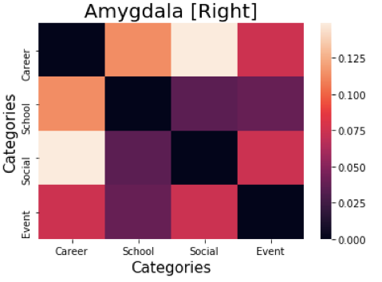

# Representational Similarity Analysis

In this study we aim to evaluate whether certain categories of stressors are grouped together based on whether they elicit similar behavioral and BOLD stress responses. We also seek to compare category relationships under behavioral versus fMRI analysis.

### Results 
#### Behavioral RSA
RSA of behavioral responses reveals the least dissimilarity for the school and career pairing, and the greatest dissimilarity for the event and career pairing. As behavioral responses were measured on a self-reported 1-4 scale, this suggests that prompts in the school and career categories were more similarly ranked, whereas there was the greatest discrepancy in ratings across the career and event categories. In order, career and school responses were most similar, followed by social and event, school and social, career and social, and career and event. 

  

**Figure 1: Behavioral Response dissimilarity matrix for career, school, social, and event categories. Average over all 10 subjects and 3 runs**

We also examined whether the order of the prompts had any effect on the degree of response similarity between sets of categories. The dissimilarity matrix is largely the same for the individual orders, with the exception that the school and social category similarity is higher in the second order. This suggests that the order of the questions does not greatly affect reported response (i.e. numerical ranking).

#### fMRI RSA
**1. Amygdala**
Representational dissimilarity matrices (RDMs) constructed from RSA of different brain regions were found to be varied. In both the right and left amygdala, responses to school prompts were highly correlated with responses to social prompts, and responses for school prompts were also correlated with responses for event prompts. This correlation was higher in the left amygdala in both cases.

**Figure 2: Dissimilarity matrices for left and right amygdala**

**2. Hippocampus**
RSA of the hippocampus shows the least dissimilarity for the social and event categories and the most dissimilarity in response for the event and career categories (left hippocampus), and career and social categories (right hippocampus). 

**Figure 3: Dissimilarity matrices for left and right hippocampus**

*In both the amygdala and the hippocampus, school and event categories and school and social categories seemed to show low dissimilarity. This contrasts with the results of the behavioral matrix in which these two category pairs are less similar in comparison to the highly similar school and career, and social and event categories.*

**3. Cigulate Cortex**
The dissimilarity matrix constructed from the activity of the cingulate cortex shows that responses for the school and social categories tended to be more similar (which is also generally true in the amygdala and hippocampus). However, there is an extremely low dissimilarity between the event and career categories. This is interesting as these categories were lest similar in self-reported stress level in the behavioral analysis. 

**Figure 4: Dissimilarity matrix for right cingulate cortex**

Overall, behavioral responses for the career and school categories were most similar (high rating of stress) and responses for career and event categories were most dissimilar (suggesting that event prompts tended to be ranked at low stress ratings). fMRI responses for school and social tended to be grouped as relatively similar across all brain regions examined, although this relationship is strongest in the right cingulate cortex and left amygdala. In contrast to the behavioral analysis, in the fMRI analysis career and school were not the relatively more similar pairings. Career and social categories were fairly dissimilar across the majority of analyses carried out. 
